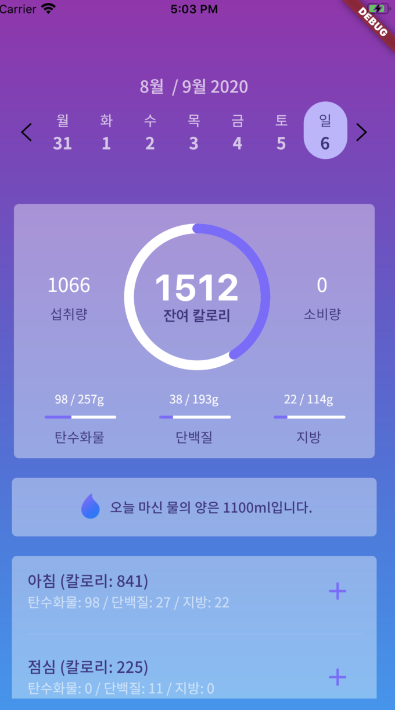
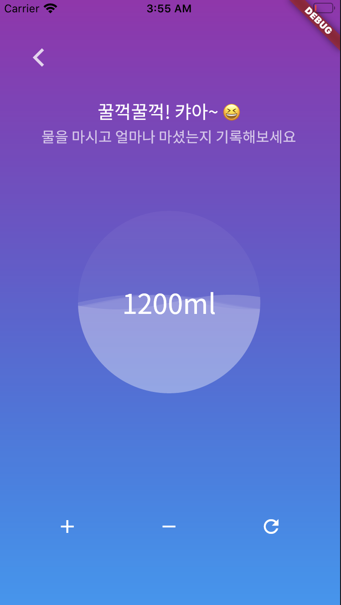
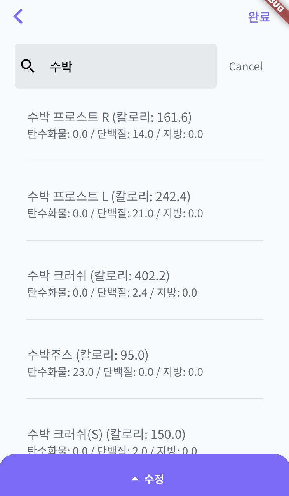
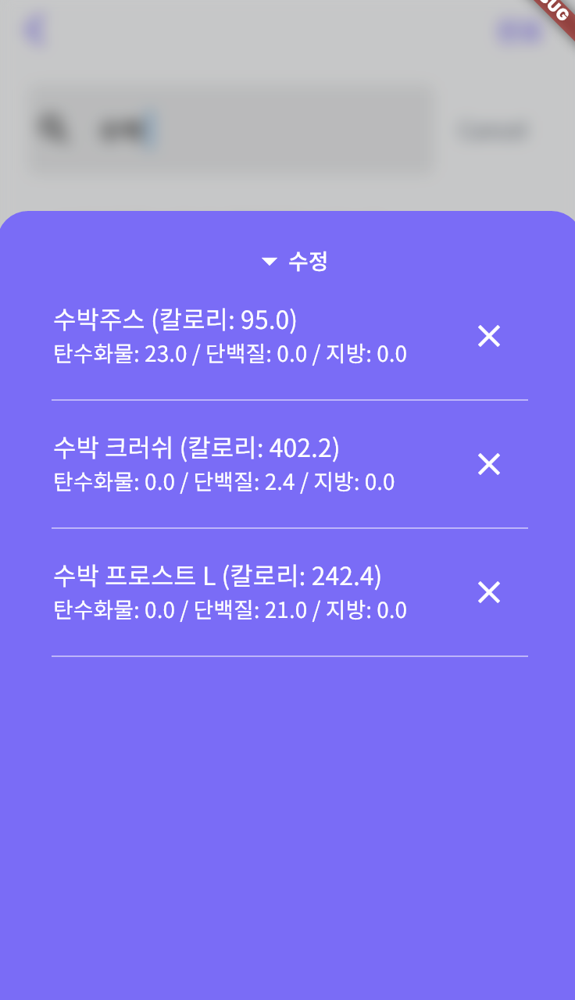
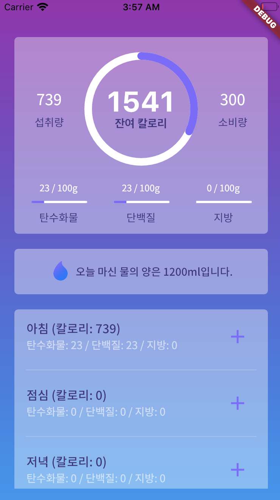

# dreambody

A new Flutter project.

## Run app in local

1. run h2 for backend

- [`h2` db download](https://www.h2database.com/html/main.html)
- chmod +x h2.sh
- run `h2.sh` in bin folder.
- create db
- connect to db in h2 web console

2. run server

- git clone this [repository](https://github.com/tandohak/dreambody)
- after run h2, command `gradle bootRun`

3. run flutter

- open Android or iOS simulator
- run main.dart

4. before building app

- [command `flutter pub run tool/env.dart`. It makes `lib/.env.dart` for env variables used in runtime.](https://medium.com/flutter-community/use-environment-variables-in-ci-cd-for-flutter-apps-cbd6d9ac82c)

## app images & video

1. dashboard

- video: [youtube](https://youtu.be/tfoVp7TQHAE)
- dashboard with calendar

  

- water dashboard

  

- food search

- drawer

  

- dashboard after record

  
